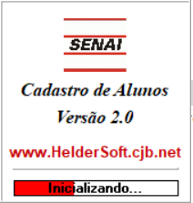

# SENAI Cadastro de Alunos

Software developed in 2001-2003 using Delphi (Object-Pascal) language for the SENAI school in Presidente Prudente/SP, Brazil.

## Features

- Report generator.
- Paradox database.
- Register of occurrences.
- Utility to backup the database.

## Screenshots

---

Presidente Prudente, SP, Brazil

[SENAI, "Santo Paschoal Crepaldi" - Serviço Nacional de Aprendizagem Industrial](https://presidenteprudente.sp.senai.br/)

